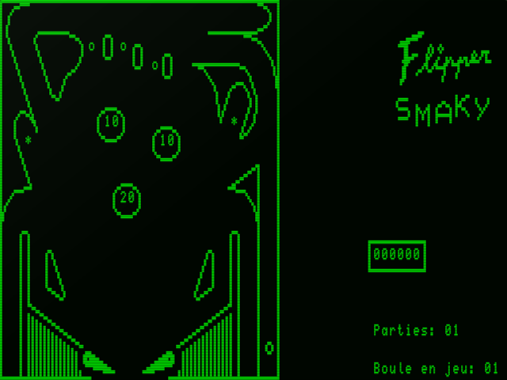
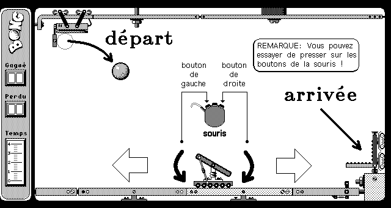
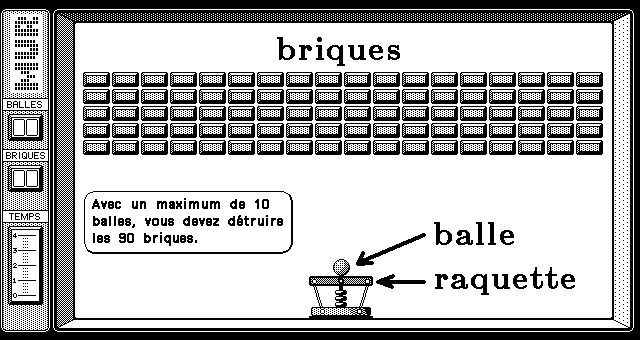
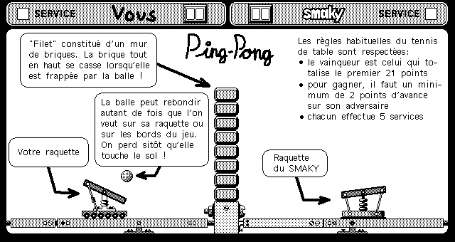

# Smaky legacy games

Here you can find the binaries, the source codes and the assets of some very old
Smaky games written by Daniel Roux in CALM (Common Assembly Language for
Microprocessors). Everything is published under the GPLv3+ license. AllM680002
games are playable with the Smaky Infini emulator (only for Windows) available
here: https://www.smaky.ch/le-smaky-infini-libre/

For the FLIPPER game, you can try the Smaky 6 emulator here:
https://sch-lika.github.io/smemu6/

| Game            | Year | Language       | Directory |
| --------------- | ---- | -------------- | --------- |
| FLIPPER         | 198? | CALM / Z80     | `flipper` |
| BONG            | 1987 | CALM / M680002 | `bong`    |
| MUR             | 1987 | CALM / M680002 | `mur`     |
| PING            | 1987 | CALM / M680002 | `ping`    |
| TOTO SE PROMÈNE | 1991 | CALM / M680002 | `totop`   |

For more resources, look at the `doc/` directory of each game. You will find PNG
images (same as the `.IMAGE` and `.COLOR` files) and PDF files (same as the
`.PAGE` files).

The assembly files use an unusual charset. You can use the `smascii` tool
provided by the [Fosfat project][1] in order to convert the files into
ISO-8859-1 charset.

## FLIPPER

## BONG

## MUR

## PING

## TOTO SE PROMÈNE

# Other

Read [README.rescue.md](README.rescue.md) for a HOWTO (backup, restore and read
a Smaky hard or floppy disk).

[1]: https://github.com/Skywalker13/Fosfat
